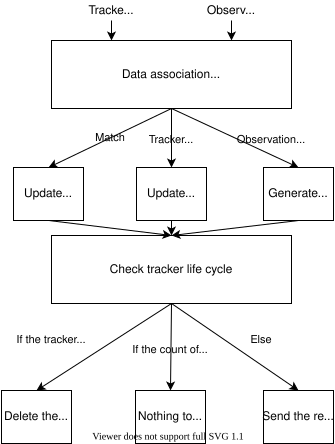
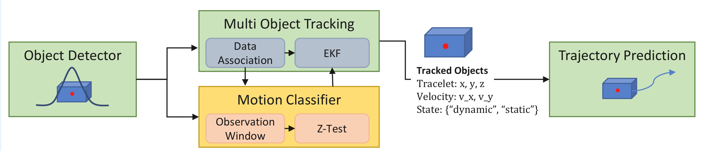

# multi_object_tracker

## Purpose

The results of the detection are processed by a time series. The main purpose is to give ID and estimate velocity.

## Inner-workings / Algorithms

This multi object tracker consists of data association and EKF.



The motion classifier reuses the tracker's data association but otherwise works in parallel.



### Data association

The data association performs maximum score matching, called min cost max flow problem.
In this package, mussp[1] is used as solver.
In addition, when associating observations to tracers, data association have gates such as the area of the object from the BEV, Mahalanobis distance, and maximum distance, depending on the class label.

### EKF Tracker

Models for pedestrians, bicycles (motorcycles), cars and unknown are available.
The pedestrian or bicycle tracker is running at the same time as the respective EKF model in order to enable the transition between pedestrian and bicycle tracking.
For big vehicles such as trucks and buses, we have separate models for passenger cars and large vehicles because they are difficult to distinguish from passenger cars and are not stable. Therefore, separate models are prepared for passenger cars and big vehicles, and these models are run at the same time as the respective EKF models to ensure stability.

### Motion Classifier

The motion classifier uses the aleatoric uncertainties provided by the object detector, groups them into one observation window for each object and calculates the probability of a mean shift within the window using the two-sided z-test on x and y locations. If an object is deemed static, the classifier resets the tracker's velocity state variables to zero and smoothes the location by computing an average over the observation window.
Using the motion classifier requires manual tuning of the z-score thresholds. However, the standard values in the config files deliver satisfying results for a wider range of input data.


## Inputs / Outputs

### Input

Multiple inputs are pre-defined in the input channel parameters (described below) and the inputs can be configured

| Name                      | Type                       | Description            |
| ------------------------- | -------------------------- | ---------------------- |
| `selected_input_channels` | `std::vector<std::string>` | array of channel names |

- default value: `selected_input_channels:="['detected_objects']"`, merged DetectedObject message
- multi-input example: `selected_input_channels:="['lidar_centerpoint','camera_lidar_fusion','detection_by_tracker','radar_far']"`

### Output

| Name       | Type                                            | Description     |
| ---------- | ----------------------------------------------- | --------------- |
| `~/output` | `autoware_perception_msgs::msg::TrackedObjects` | tracked objects |

## Parameters

### Input Channel parameters

{{ json_to_markdown("perception/autoware_multi_object_tracker/schema/input_channels.schema.json") }}

### Core Parameters

{{ json_to_markdown("perception/autoware_multi_object_tracker/schema/multi_object_tracker_node.schema.json") }}
{{ json_to_markdown("perception/autoware_multi_object_tracker/schema/data_association_matrix.schema.json") }}

#### Simulation parameters

{{ json_to_markdown("perception/autoware_multi_object_tracker/schema/simulation_tracker.schema.json") }}

## Build

```bash
source /opt/ros2/humble/setup.bash
cd /YOUR/AUTOWARE/PATH/Autoware
source install/setup.bash
colcon build --packages-select autoware_lidar_centerpoint
```

## Assumptions / Known limits

See the [model explanations](models.md).


## References/External links

This package makes use of external code.

| Name                                                      | License                                                   | Original Repository                  |
| --------------------------------------------------------- | --------------------------------------------------------- | ------------------------------------ |
| [muSSP](src/data_association/mu_successive_shortest_path) | [Apache-2.0](https://www.apache.org/licenses/LICENSE-2.0) | <https://github.com/yu-lab-vt/muSSP> |

[1] C. Wang, Y. Wang, Y. Wang, C.-t. Wu, and G. Yu, “muSSP: Efficient
Min-cost Flow Algorithm for Multi-object Tracking,” NeurIPS, 2019


